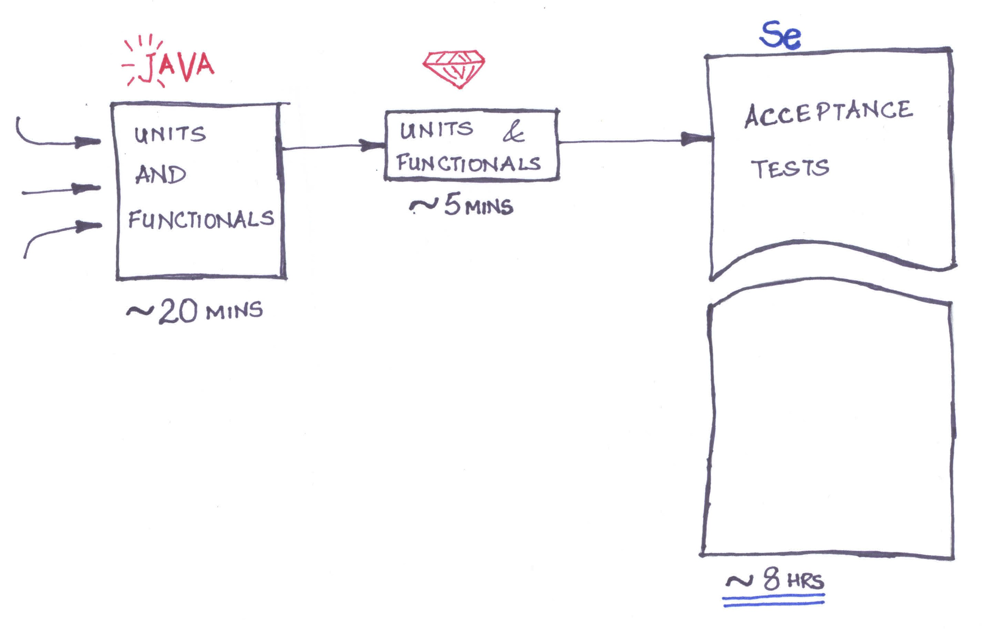
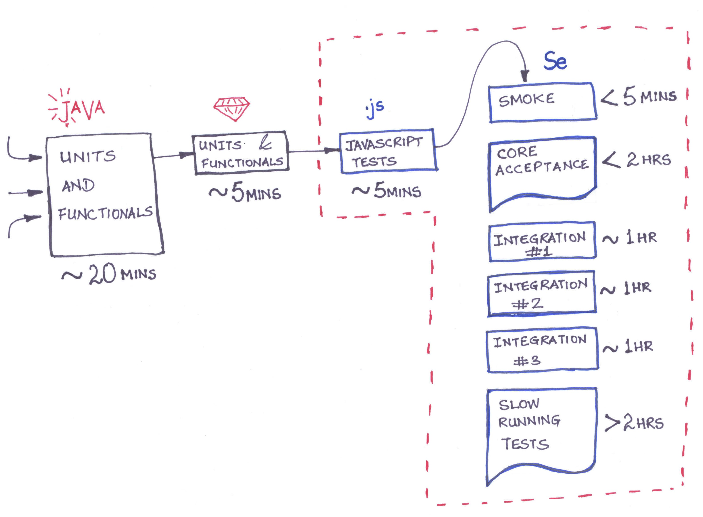

# Better Builds : Faster Feedback

!SLIDE

# Better Builds : Faster Feedback

## @sudhindraRao
### srao@thoughtworks.com

!SLIDE left

## What we will talk about

### Continuous Integration concepts across different technologies

### Identifying feedback loops in CI

### Parallelizing builds
 
!SLIDE left

## CI Tools

### CruiseControl - Java, .NET, ruby

### Hudson - was open source, free to use - now Oracle

### Jenkins - fork of Hudson - free

### Configurable

!NOTES

### should have plugins
 
### should allow custom build jobs

### should provide different levels of reporting

!SLIDE 

# Someone somewhere broke my code ... maybe

}}} images/retailstore.jpg

!SLIDE left

## Large scale integration

### Different teams on different development cycle

### Failing builds because other teams are not testing - <em>yet</em>

### Delivery rush causes everyone to ignore other builds

### Selenium builds took hours so were ignored

!NOTES

* Other teams do not have a testing strategy so they are writing tests
  after the fact

!SLIDE left

## Continuous Integration takes too long

### Tests are flaky

### Too many things printed on the report

### Delivery pressure is a distraction to quality

!SLIDE

!SLIDE left

### Run Unit and Functional CI as basic build

### Make smoke tests as part of the basic build

### Distribute responsibility to the integrating parties

!NOTES

### If they can't fix them atleast they can tell you what change caused them to break

!SLIDE left

## Contextual selenium tests

### Group acceptance test by area

### Integration points are identified by selenium tags

### Long running tests are run once a day 

!SLIDE

!SLIDE left

## Results

### Better visibility of builds

### Confidence to check-in code

### Reliable Delivery

!SLIDE left

# Lots of apps ... rapid delivery cycle

}}} images/data-center.jpg

!SLIDE left

## Continuous Integration for a datacenter

### Inventory management, Configuration Management, Network Management, etc.

### Many small applications => Application suite

### Reduce cycle time of provisioning servers

!SLIDE left

### In the beginning there were <em>28</em> apps and <em>37</em> builds(including integration builds)

### Usually the team worked on 1-2 related apps at a time. 

### Lacked awareness of complete application 

### Team did not know what is broken

!SLIDE

}}} images/cc_monitor_example.png

!NOTES

(since cruisecontrol only showed a list of projects with their history)

### Need a dashboard that shows what is going on.

### Need something that is always on and in the team's face to indicate system state.

!SLIDE left

## Results

### Feedback helped the key stake holders

### Forced redesign - balance maintenance with velocity

### Dependent applications were merged

### Retired old applications

!SLIDE

# Complex legacy code ... 72 hours of deployment

}}} images/healthcare.jpg

!SLIDE left

## Large Scale, Legacy, Mission Critical .NET application

### Low coverage test suite

### No build etiquette

### Need to build new features rapidly

!SLIDE 

!SLIDE left

## Building the build pipeline

### Initial build time was 2 mins 

### As the coverage started increasing the build time started growing

### Establish a work etiquette for builds and continuous integration.

!SLIDE

## Canary in the coalmine

!SLIDE left

### Time to add a smoke test suite

### Time to add an acceptance test suite

### Time to split test suite by responsibility and application area

!SLIDE left

## Results

### Delivery every month

### Deployment during the day - Non-event

### Multiple streams of development

!NOTES

### It was tolerable for a week or two with ~5 min build. But with the testing team getting more conversant with the Application and writing more tests/deeper tests, the build time started growing rapidly. 

!SLIDE left

## Tests take too long to run

}}} images/Into-the-Cloud.jpg

!SLIDE left

## Making builds efficient

### Parallelize builds

### Spork, Parallel Tests, Selenium Grid

### Go, Jenkins Agents

!SLIDE left

## Cloud for testing

### Amazon cloud EC2 is cost effective for short term usage

### <em> Don't ignore the learning curve </em>

### Security restrictions make it hard to deploy 

### Data movement can be very expensive

!NOTES

### Since builds are not going away - hosting your own infrastructure might be more cost effective

### Saucelabs has a business around this

!SLIDE left

## Lessons learnt

### Continuous Integration concepts <em>translate</em> across different technologies

### Identifying feedback loops in CI that fit the context leads to <em>faster corrective action</em>

### Resource management is <em>not trivial</em>

!SLIDE

#     Thank you

##    @sudhindraRao

###   srao@thoughtworks.com

